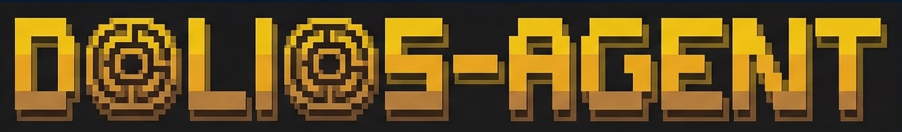

<p align="center">
  
</p>

# Dolios Agent Δ

<p align="center">
  <a href="https://github.com/guglxni/dolios-agent"></a>
  <a href="https://github.com/guglxni/dolios-agent/blob/main/LICENSE"></a>
  <a href="https://github.com/guglxni"></a>
</p>

**The Crafty Agent: Scheme. Execute. Deliver.** Dolios is a self-improving AI agent with production-grade sandboxing. It builds on [Hermes Agent](https://github.com/NousResearch/hermes-agent)'s closed learning loop and [NemoClaw](https://github.com/NVIDIA/NemoClaw)'s Landlock/seccomp isolation, adding multi-provider inference routing, [AI-DLC](https://github.com/awslabs/aidlc-workflows) methodology awareness, and a [DSPy/GEPA](https://github.com/NousResearch/hermes-agent-self-evolution) self-evolution pipeline. Runs on a $5 VPS, a GPU cluster, or serverless.

Use any model: [NVIDIA Nemotron](https://build.nvidia.com), [Nous Portal](https://portal.nousresearch.com), [OpenRouter](https://openrouter.ai) (200+ models), [Kimi/Moonshot](https://platform.moonshot.ai), [MiniMax](https://www.minimax.io), OpenAI, Anthropic, or local via Ollama/vLLM. Switch with `dolios model`, no code changes, no lock-in.

<table>
<tr><td><b>Sandboxed execution</b></td><td>Every tool call runs inside a NemoClaw/OpenShell sandbox with Landlock filesystem isolation, seccomp process restrictions, and deny-by-default network policies. No tool can <code>rm -rf /</code> or exfiltrate data; the sandbox blocks it at the kernel level.</td></tr>
<tr><td><b>Self-improving skills</b></td><td>Closed learning loop: the agent creates procedural skills from experience, improves them via DSPy/GEPA optimization ($2-10 per cycle, no GPU), and persists knowledge across sessions. Compatible with the <a href="https://agentskills.io">agentskills.io</a> open standard.</td></tr>
<tr><td><b>Lives where you do</b></td><td>Telegram, Discord, Slack, WhatsApp, Signal, and CLI, all from a single gateway process. Voice memo transcription, cross-platform conversation continuity.</td></tr>
<tr><td><b>Methodology-aware</b></td><td>AI-DLC workflow engine: Inception → Construction → Operations phases for structured task execution. The agent asks the right questions before coding, follows a plan, and validates before delivering.</td></tr>
<tr><td><b>Multi-provider inference</b></td><td>Smart routing across NVIDIA, Nous, OpenRouter, OpenAI, Anthropic, Kimi, MiniMax, and local models, all intercepted by the sandbox inference gateway. Cost-aware selection based on task type.</td></tr>
<tr><td><b>Security-first</b></td><td>Fail-closed defaults, prompt injection scanning, API key redaction, atomic writes, and strict evolution constraint gates are built into the runtime and workflows.</td></tr>
<tr><td><b>Research-ready</b></td><td>Batch trajectory generation, Atropos RL environments, execution trace collection, trajectory compression for training the next generation of tool-calling models.</td></tr>
</table>

---

## Quick Install

```bash
curl -fsSL https://raw.githubusercontent.com/guglxni/dolios-agent/main/scripts/install.sh | bash
```

Works on Linux, macOS, and WSL2. The installer handles Python, uv, dependencies, vendor repos, and the `dolios` command.

> **Windows:** Native Windows is not supported. Please install [WSL2](https://learn.microsoft.com/en-us/windows/wsl/install) and run the command above.

After installation:

```bash
source ~/.bashrc    # reload shell (or: source ~/.zshrc)
dolios setup        # guided configuration wizard
dolios              # start chatting!
```

Or install manually:

```bash
git clone https://github.com/guglxni/dolios-agent.git
cd dolios-agent
bash scripts/install.sh    # clones vendor repos + installs deps
dolios setup
dolios
```

---

## Getting Started

```bash
dolios              # Interactive CLI — start a conversation
dolios setup        # Full setup wizard (providers, API keys, sandbox)
dolios model        # Choose your inference provider and model
dolios sandbox status   # Check sandbox health and policy state
dolios sandbox policy   # View active network policies
dolios sandbox approve  # Approve pending endpoint access requests
dolios evolve run   # Run self-evolution pipeline on a skill
dolios aidlc        # Show current AI-DLC workflow phase
dolios doctor       # Diagnose any issues
dolios upstream status            # Show local/remote upstream commit state
dolios upstream sync --include-aidlc  # Sync latest upstream repos + AI-DLC rules
dolios verify release  # Run production-grade release verification checks
uv sync --extra optional-tools  # Enable optional Firecrawl/FAL-backed tool integrations
# Optional interactive AI-DLC runtime controls (enable with DOLIOS_AIDLC_REQUIRE_APPROVAL=true):
# /aidlc status | /aidlc approve | /aidlc approve construction
```

---

## Architecture

```
┌──────────────────────────────────────────────────────────────┐
│                      USER INTERFACES                         │
│    CLI (TUI) · Telegram · Discord · Slack · WhatsApp         │
└──────────┬───────────────────────────────────────────────────┘
           │
           ▼
┌──────────────────────────────────────────────────────────────┐
│                    DOLIOS ORCHESTRATOR                       │
│                                                              │
│  Policy Bridge · Inference Router · AI-DLC Engine            │
│  Brand Layer   · Trace Collector  · Prompt Injection Scan    │
└──────────┬───────────────────────────────────────────────────┘
           │
           ▼
┌──────────────────────────────────────────────────────────────┐
│                   HERMES AGENT RUNTIME                       │
│                                                              │
│  Agent Loop · Skills · Memory · Tools · Gateway              │
│  Subagents  · Honcho · Cron   · MCP   · FTS5 Search          │
└──────────┬───────────────────────────────────────────────────┘
           │
           ▼
┌──────────────────────────────────────────────────────────────┐
│                   NEMOCLAW SANDBOX LAYER                     │
│                                                              │
│  Network Policy · Filesystem Isolation · Process Sandbox     │
│  (deny-default) · (Landlock strict)    · (seccomp)           │
│  Inference Gateway · Blueprint Lifecycle · Policy YAML       │
└──────────┬───────────────────────────────────────────────────┘
           │
           ▼
┌──────────────────────────────────────────────────────────────┐
│                    INFERENCE PROVIDERS                       │
│                                                              │
│  NVIDIA Nemotron · Nous Portal · OpenRouter (200+ models)    │
│  Kimi / Moonshot · MiniMax     · OpenAI · Local (Ollama)     │
└──────────────────────────────────────────────────────────────┘
```

---

## Documentation

| Section | What's Covered |
|---------|---------------|
| [Quickstart](#quick-install) | Install → setup → first conversation in 2 minutes |
| [Technical PRD](https://github.com/guglxni/dolios-agent/blob/main/dolios-technical-prd.md) | Full architecture spec, integration maps, implementation roadmap |
| [AI-DLC Workflow](https://github.com/guglxni/dolios-agent/blob/main/CLAUDE.md) | Workflow rules, code conventions, security rules (DOLIOS-SEC) |
| [Agent Instructions](https://github.com/guglxni/dolios-agent/blob/main/AGENTS.md) | Instructions for AI coding agents working on this repo |
| [Contributing](https://github.com/guglxni/dolios-agent/blob/main/CONTRIBUTING.md) | Development setup, PR process, skill/policy authoring |
| [Release Checklist](https://github.com/guglxni/dolios-agent/blob/main/aidlc-docs/release-checklist.md) | Preflight + quality + security gates before release |
| [Brand Identity](https://github.com/guglxni/dolios-agent/tree/main/brand) | SOUL.md personality, voice guidelines, brand context |
| [Skills](https://github.com/guglxni/dolios-agent/tree/main/skills) | 6 Dolios-specific skills with SKILL.md definitions |
| [Sandbox Policies](https://github.com/guglxni/dolios-agent/tree/main/dolios-blueprint/policies) | NemoClaw-format Landlock/seccomp/network policies |

---

## Releases

| Version | Branch | Date | Highlights |
|---------|--------|------|------------|
| [v0.3.0-hardened](https://github.com/guglxni/dolios-agent/releases/tag/v0.3.0-hardened) | `hardened` | Apr 2026 | IronClaw security layer — AuditLogger, WorkflowPolicy DAG, CredentialVault, DLPScanner, per-tool capability manifests |
| [v0.3.0](https://github.com/guglxni/dolios-agent/releases/tag/v0.3.0) | `main` | Apr 2026 | Native fusion runtime — PolicyEngine reads vendor NemoClaw YAML directly, SandboxBackend ABC with full plan/apply/execute lifecycle, 131 tests |
| [v0.2.1](https://github.com/guglxni/dolios-agent/releases/tag/v0.2.1) | `main` | Apr 2026 | Full OWASP Top 10 + Agentic AI Security audit — 9 security fixes, 10 code quality fixes, CI green |
| [v0.2.0](https://github.com/guglxni/dolios-agent/releases/tag/v0.2.0) | `main` | Apr 2026 | Native Fusion Runtime and Production Gates |
| [v0.1.0](https://github.com/guglxni/dolios-agent/releases/tag/v0.1.0) | `main` | Mar 2026 | Initial release — brand, architecture, AI-DLC methodology |

The `hardened` branch tracks `main` and layers IronClaw-inspired security enhancements on top. It is kept separate and rebased onto `main` as the baseline evolves.

---

## Self-Evolution

Dolios integrates the [hermes-agent-self-evolution](https://github.com/NousResearch/hermes-agent-self-evolution) pipeline for continuous skill improvement. No GPU required; runs via API calls at ~$2-10 per optimization cycle.

```bash
dolios evolve run                    # list available evolution targets
dolios evolve run --target skill-sandbox-status --iterations 10
dolios evolve run --target skill-trace-analyze --dry-run
```

**Safety guardrails:** 7 constraint gates must ALL pass: tests, size limit, growth limit (max 20%), structural validation, non-empty, semantic preservation, and security pattern detection. Security-critical files (policies, routing code) are excluded from auto-evolution. All changes require human PR review.

## Optional Integrations

Some Hermes tool modules require optional third-party SDKs. Dolios keeps these integrations optional and reports their status in release verification.

```bash
uv sync --extra optional-tools
uv run dolios verify release   # includes optional-tool-deps diagnostic row
```

---

## Migrating from Hermes Agent

If you're coming from [Hermes Agent](https://github.com/NousResearch/hermes-agent), Dolios extends it with sandboxing and self-evolution while preserving full compatibility:

| What | Status |
|------|--------|
| **SOUL.md** | Migrated to `brand/SOUL.md` with Dolios identity |
| **Skills** | All 25 Hermes skill categories available, plus 6 Dolios-specific skills |
| **Memory & sessions** | Preserved via Hermes SessionDB (SQLite + FTS5) |
| **Tools (40+)** | Core tools available by default; optional web/image integrations available with `uv sync --extra optional-tools`; all still enforced by NemoClaw policy |
| **Multi-platform gateway** | Telegram, Discord, Slack, WhatsApp, Signal (unchanged) |
| **Cron scheduler** | Unchanged |
| **Honcho user modeling** | Unchanged |
| **OpenClaw migration** | Supported via `hermes claw migrate` (inherited from Hermes) |

---

## Contributing

We welcome contributions! See the [Contributing Guide](CONTRIBUTING.md) for development setup, code style, and PR process.

Quick start for contributors:

```bash
git clone https://github.com/guglxni/dolios-agent.git
cd dolios-agent
bash scripts/install.sh    # clones vendor repos + installs deps
uv sync --extra dev
uv sync --extra optional-tools  # optional Firecrawl/FAL integrations
uv run pytest -v           # 98 tests passing
uv run ruff check dolios/  # lint
uv run ruff format dolios/ # format
```

Development follows the [AI-DLC methodology](CLAUDE.md): read the PRD, validate requirements, implement with tests, verify with sandbox.

---

## Community

- Discord — Coming soon
- GitHub Discussions — Coming soon
- [Skills Hub](https://agentskills.io) — Browse and share agent skills (agentskills.io open standard)
- [GitHub Issues](https://github.com/guglxni/dolios-agent/issues) — Bug reports and feature requests

---

## License

MIT. See [LICENSE](LICENSE).

Built on [Hermes Agent](https://github.com/NousResearch/hermes-agent) by [Nous Research](https://nousresearch.com) and [NemoClaw](https://github.com/NVIDIA/NemoClaw) by [NVIDIA](https://nvidia.com).
